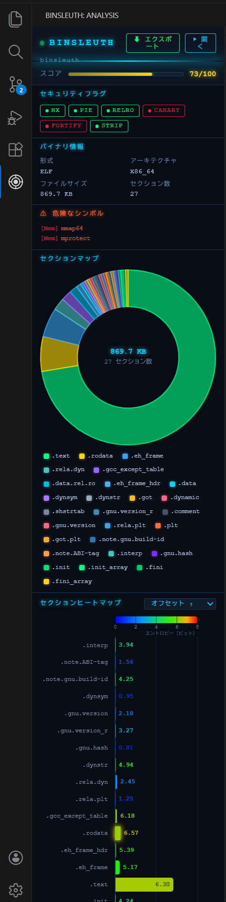

# vscode-binsleuth

> セクションマップ・エントロピーヒートマップ・セキュリティフラグを VS Code のサイドバーに表示するバイナリ解析拡張機能。


<div align="center">

[](https://code.visualstudio.com/)
[](LICENSE)
[](https://www.rust-lang.org/)
[](https://crates.io/crates/binsleuth)
[](https://github.com/long-910/vscode-binsleuth/actions/workflows/ci.yml)
[](https://github.com/long-910/vscode-binsleuth/actions/workflows/release.yml)
[](https://github.com/sponsors/long-910)
[](https://ko-fi.com/long910)

🌐 [English](README.md) | [日本語](README.ja.md) | [中文](README.zh.md)

</div>

---

## スクリーンショット



---

## 表示内容

```
バイナリファイル ──► binsleuth-bridge（Rust）──► JSON ──► Webview サイドバー
                    · セクション情報                       · セクションマップ
                    · Shannon エントロピー                  · セクションヒートマップ
                    · セキュリティフラグ                    · セキュリティスコア
                    · 危険なシンボル                        · 危険なシンボル一覧
                                                     チャートをクリック → オフセットへジャンプ
```

Rust ブリッジはサブプロセスとして実行されます。**ネットワーク通信・テレメトリは一切なし。**

---

<div align="center">

</div>

---

## 機能

### セクションマップ

各セクションのディスク上サイズをドーナツチャートで可視化します。

- セクション種別ごとのネオンカラー弧（`.text` 緑、`.data` シアン、`.bss` 紫 など）
- 中央ラベル：ファイルサイズ合計とセクション数
- ホバーツールチップ：名前・サイズ・ファイルオフセット・エントロピー・権限（RWX）
- **スライスをクリック** → Hex Editor でそのセクションのオフセットへジャンプ

### セクションヒートマップ

全セクションの**サイズとエントロピー**を水平バーチャートで同時に可視化します。

| 視覚要素 | 表現する情報 |
|---------|------------|
| バーの長さ | セクションサイズ（x 軸、バイト単位） |
| バーの色 | Shannon エントロピー — 冷青（0 bit）→ 熱赤（8 bit） |
| バー上の数値 | 正確なエントロピー値 |
| ネオングロー | エントロピー > 6.5 — パック済みまたは暗号化の可能性 |

参照用のグラデーションカラーレジェンド（0〜8 bit）をチャート上部に表示します。

**ソートセレクター**（パネル右上）:

| オプション | 順序 |
|-----------|------|
| オフセット ↑ | ファイルオフセット昇順（デフォルト） |
| サイズ ↓ / ↑ | 大きいセクション順 / 小さいセクション順 |
| エントロピー ↓ / ↑ | 高エントロピー順 / 低エントロピー順 |
| 名前 A-Z | アルファベット順 |

**バーをクリック** → そのセクションのファイルオフセットへジャンプ。

### セキュリティフラグパネル

ハードニングバッジを一覧表示します：

| バッジ | 意味 |
|------|------|
| `NX` | 実行不可スタック / DEP |
| `PIE` | 位置独立実行ファイル |
| `RELRO` | リロケーション読み取り専用（Full / Partial） |
| `CANARY` | スタックカナリー（`__stack_chk_fail`） |
| `FORTIFY` | FORTIFY_SOURCE |
| `STRIP` | デバッグシンボルが除去済み |

カラーコード: **緑** = 有効 · **オレンジ** = 部分的 · **赤** = 無効 · **グレー** = 非該当

**セキュリティスコア**（0〜100）をヘッダーに表示します（高いほど安全）。

### 危険なシンボル検出

バイナリがシェル実行・ネットワーク I/O・メモリ操作などの高リスクカテゴリに属するシンボルをインポートしている場合、カテゴリタグ付きでサイドバーに一覧表示されます。

### 自動検出

認識済みのバイナリ拡張子を持つファイルを開くと、自動的に解析が開始されます。
コマンドの実行は不要です。

---

## 使い方

### 解析のトリガー

| 方法 | 用途 |
|------|------|
| エディタでバイナリファイルを開く | 最も手軽 — 自動的に解析が開始 |
| エクスプローラーでファイルを右クリック → **BinSleuth: バイナリを解析** | ファイルを開かずに解析 |
| **Ctrl+Shift+P** → **BinSleuth: アクティブファイルを解析** | フォーカス中のファイルを再解析 |

### ヘッダーボタン

| ボタン | 動作 |
|------|------|
| **開く** | 解析済みバイナリを Hex Editor（またはデフォルトエディタ）で開く |
| **エクスポート ▾** | レポートを保存 — **Markdown**・**JSON**・**CSV** から形式を選択 |

### セクションへのナビゲーション

セクションマップのスライス**または**セクションヒートマップのバーをクリックします。
[Hex Editor](https://marketplace.visualstudio.com/items?itemName=ms-vscode.hexeditor) がインストールされている場合、そのセクションのファイルオフセットに直接ジャンプします。
インストールされていない場合は `vscode.open` でファイルを開きます。

### レポートのエクスポート

1. サイドバーヘッダーの **エクスポート ▾** をクリック。
2. 形式を選択：**Markdown**（人間が読みやすい形式）、**JSON**（機械可読形式）、**CSV**（表計算ソフト用）。
3. 保存ダイアログが開くので、保存先を選択して保存。

レポートには、バイナリのメタデータ・各セクションの表（名前・サイズ・オフセット・エントロピー・権限）・セキュリティフラグ・危険なシンボルが含まれます。

---

## WSL / Windows サポート

| シナリオ | WSL が必要か |
|---------|:-----------:|
| WSL 内の VS Code（Remote - WSL） | 不要 |
| Windows VS Code + `win32-x64` VSIX | 不要 |
| WSL でビルドした VSIX を Windows VS Code で使用 | 必要 |

---

## インストール

### VS Code Marketplace（推奨）

1. VS Code で **拡張機能**（`Ctrl+Shift+X`）を開きます。
2. **BinSleuth** を検索します。
3. **インストール** をクリックします。

または [VS Code Marketplace ページ](https://marketplace.visualstudio.com/items?itemName=long-910.vscode-binsleuth) から直接インストールできます。

### GitHub Releases から

特定のプラットフォーム向けビルドが必要な場合は、[Releases ページ](https://github.com/long-910/vscode-binsleuth/releases) から VSIX をダウンロードします：

| ファイル | プラットフォーム |
|---------|--------------|
| `*-linux-x64.vsix` | Linux x64 |
| `*-darwin-arm64.vsix` | macOS Apple Silicon |
| `*-darwin-x64.vsix` | macOS Intel |
| `*-win32-x64.vsix` | Windows x64 |

インストール: **拡張機能（Ctrl+Shift+X）** → **⋯** → **VSIX からインストール…**

> **Windows の注意:** VS Code は WSL の UNC パス（`\\wsl.localhost\...`）からは VSIX をインストールできません。
> ローカルの Windows ドライブ（例: `C:\Users\...\Downloads\`）に保存してからインストールしてください。

### 要件

| 依存関係 | バージョン | 備考 |
|---------|---------|------|
| VS Code | ≥ 1.85 | |
| [Hex Editor](https://marketplace.visualstudio.com/items?itemName=ms-vscode.hexeditor) | 任意 | オプション — クリックによるオフセットナビゲーションを有効化 |
| WSL（Windows のみ） | 任意 | `win32-x64` VSIX 以外の場合に必要 |

---

## ロードマップ

| 機能 | 状態 |
|------|------|
| セクションマップ（ドーナツチャート） | ✅ v0.1.0 |
| セクションヒートマップ（サイズ + エントロピー、ネオングロー） | ✅ v0.1.0 |
| セキュリティフラグパネル（NX / PIE / RELRO / …） | ✅ v0.1.0 |
| セキュリティスコア（0〜100） | ✅ v0.1.0 |
| 危険なシンボル検出 | ✅ v0.1.0 |
| クリックによるオフセットナビゲーション | ✅ v0.1.0 |
| バイナリを開いたときの自動解析 | ✅ v0.1.0 |
| レポートのエクスポート（Markdown / JSON / CSV） | ✅ v0.1.0 |
| マルチ OS 対応（Windows ネイティブ・macOS・Linux） | ✅ v0.1.0 |
| 多言語対応（日本語・中国語） | ✅ v0.1.0 |
| VS Code Marketplace への公開 | ✅ v0.1.0 |
| ブリッジバイナリパスの設定 | 🔲 予定 |
| PE / Mach-O 形式バッジ | 🔲 予定 |
| 差分ビュー（2つのバイナリの比較） | 🔲 予定 |

---

## 関連プロジェクト

- [BinSleuth](https://github.com/long-910/BinSleuth) — 基盤となる Rust 解析ライブラリ
- [vscode-claude-status](https://github.com/long-910/vscode-claude-status) — VS Code ステータスバーに Claude Code のトークン使用量を表示

---

## コントリビュート

開発環境のセットアップ・ビルド手順・プロジェクト構造については [CONTRIBUTING.md](CONTRIBUTING.md)（英語）を参照してください。

---

## ライセンス

[MIT](LICENSE) — © 2026 long-910
